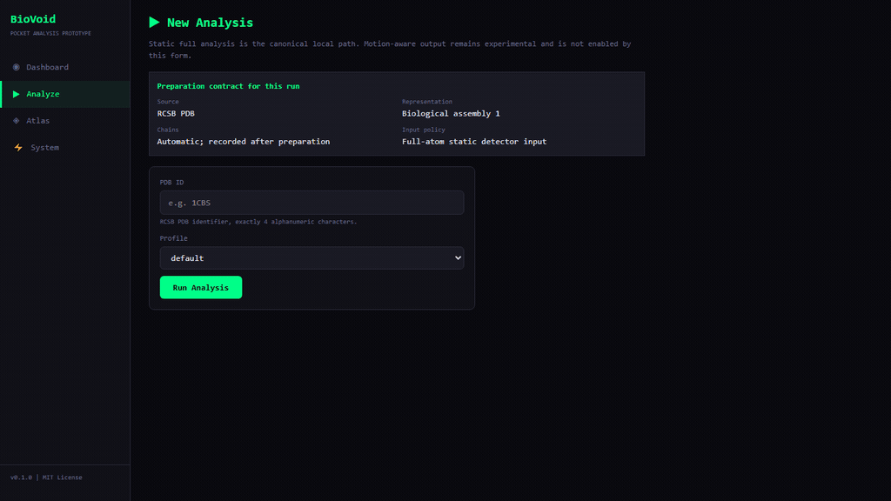

# BioVoid

BioVoid is a local computational research prototype for preparing protein
structures, detecting geometry-based pocket candidates, and inspecting
versioned heuristic measurements through a FastAPI/React application.

This repository contains source code only. It does not include local databases,
trained model files, raw PDB downloads, generated reports, or benchmark
artifacts.

The `v0.1.0` scope is a public source release for local experimentation. It
does not represent scientific validation, a benchmark result, or a claim that
motion-aware analysis improves pocket localization.

> BioVoid is not a clinical, diagnostic, validated binding-prediction, or
> drug-development system. Its outputs are unvalidated pocket candidates that
> require independent scientific review.

## 60-Second Demo



This is a real local run of the canonical static UI path using the public RCSB
structure `1CRN`, biological assembly 1 and the `default` profile. The captured
run produced 17 geometry-based pocket candidates and recorded the detector,
preparation, configuration, code and environment identities needed for review.

The number 17 is an operational example, not a benchmark score or evidence of
binding, druggability, discovery, clinical relevance or superiority. The UI
therefore labels the result as an unvalidated research-prototype output and
keeps motion/ML evidence outside the canonical static result.

## What Is Included

- Deterministic full-heavy-atom structure preparation with hashes and run
  manifests.
- A canonical static pocket detector and versioned heuristic product ranking.
- An experimental, quality-gated NMA ensemble that cannot alter canonical
  output unless a future sealed benchmark satisfies the integration gate.
- FastAPI backend with job submission, status, result download, Atlas queries,
  and health/readiness endpoints.
- React/Vite frontend for local dashboard, analysis submission, Atlas browsing,
  system status, and a bounded Mol* molecular-viewer spike.
- SQLite Atlas schema and helper APIs. The actual local Atlas database under
  `data/runtime/` is intentionally excluded from git.
- Tests for scientific invariants, the pipeline, API, Atlas persistence,
  docking wrapper, and React flows.

## Repository Hygiene

The following are intentionally ignored and should not be committed:

- `data/`
- `artifacts/`
- `memory-bank/`
- `local-private/` and `research-local/`
- SQLite databases such as `*.db`
- model files such as `*.pkl`, `*.joblib`, and `*.onnx`
- raw PDB/mmCIF files, archives, and generated reports
- `frontend/node_modules/`
- `frontend/dist/`

If you need to share generated data, use a separate release artifact or an
external storage location rather than committing it to the repository.

PDB and AlphaFold inputs are fetched or supplied locally at runtime. They are
not distributed by this repository, and results produced from them remain
local unless an independently documented release artifact is prepared.

## Requirements

- Python 3.12 or 3.13 (the supported release range is `>=3.12,<3.14`)
- Node.js and npm for the React frontend (Node.js 22.x is the CI/release-evidence baseline)
- Optional: AutoDock Vina, fpocket, and P2Rank tooling for docking or external comparisons

Third-party licenses, citations, and runtime attribution requirements are
listed in [`THIRD_PARTY_NOTICES.md`](THIRD_PARTY_NOTICES.md). The Mol* viewer
is an interface-only spike and does not alter canonical ranking or evaluator
inputs.

Install Python dependencies:

```powershell
python -m venv .venv
.venv\Scripts\python.exe -m pip install -r requirements-lock.txt
```

Install the local `biovoid` console entry point after the locked dependencies:

```powershell
python -m pip install --no-deps -e .
biovoid info
```

The editable install keeps the source-checkout workflow explicit; it does not
turn this release into a self-contained PyPI distribution.

Install frontend dependencies:

```powershell
cd frontend
npm ci
```

## Supported Local Release Path

The supported path for this source release is a local repository checkout with
the lock files installed and the frontend built in the checkout. It is not a
self-contained PyPI or wheel distribution: the canonical API serves the
generated `frontend/dist/` directory from the repository layout. Docker is an
optional operator path until its image build and healthcheck are separately
verified.

Use the canonical launcher for local work:

```powershell
python scripts/run_phase6_api.py --host 127.0.0.1 --port 8000
```

It is loopback-only by default. A non-loopback bind requires an explicit
`--allow-remote` opt-in and an authenticated network boundary. The installed
`biovoid serve` command follows the same policy.

## Run Locally

Build the canonical React UI, then start the API:

```powershell
cd frontend
npm run build
cd ..
python scripts/run_phase6_api.py --host 127.0.0.1 --port 8000
```

Open the application:

```text
http://127.0.0.1:8000/
```

After the server starts, these bounded checks confirm that the local runtime is
ready without running a protein analysis:

```powershell
Invoke-WebRequest http://127.0.0.1:8000/health
Invoke-WebRequest http://127.0.0.1:8000/ready
```

For a first UI analysis, open **Analyze**, enter a four-character RCSB PDB ID,
keep the `default` profile and static mode, then inspect the Research Status
and Provenance panels before interpreting the candidate list.

The default full-analysis path applies the live `safe-16gb` resource preflight.
If currently available RAM is insufficient, the job may fail closed before the
detector runs; the API reports this as a `RESOURCE_LIMIT` failure. Do not
interpret it as a zero-pocket result or lower the guard. On a constrained
machine, use the bounded `smoke_rcsb.py` command below as the installation
check and retry full analysis only when the resource gate passes.

`/portal` is retained only as a compatibility redirect to the canonical React
interface at `/`. For React development:

```powershell
cd frontend
npm run dev
```

The Vite dev server proxies API requests to `http://127.0.0.1:8000`.

For a local Docker run, use Compose:

```powershell
docker compose up --build
```

Compose publishes the API only on `127.0.0.1`. A standalone image remains
loopback-only by default; enabling `--allow-remote` is an explicit operator
choice and requires an authenticated network boundary.

## CLI Examples

Run a bounded live RCSB/mmCIF smoke check. The default command uses a temporary
output directory and does not commit or retain structure files:

```powershell
python scripts/smoke_rcsb.py --pdb-id 1CRN
```

The smoke output is an operational diagnostic. It reports the input, atom and
candidate counts, pocket count, detector version, resource profile and warnings;
it does not validate binding, druggability, discovery or clinical relevance.

The CLI smoke uses the `asymmetric_unit` representation and the
`bounded-rcsb-smoke-v1` resource profile. The React **Analyze** form is a
separate UI path that requests biological assembly 1; do not compare their
counts as if they were the same preparation.

Example operational output observed on 2026-08-31 (not a benchmark):

```json
{
  "status": "ok",
  "pdb_id": "1CRN",
  "input_format": "cif",
  "input_atom_count": 327,
  "protein_atom_count": 327,
  "candidate_count": 75,
  "pocket_count": 17,
  "representation": "asymmetric_unit",
  "detector_version": "canonical-static-v1",
  "resource_profile": "bounded-rcsb-smoke-v1",
  "prepared_sha256": "4cd16376e9ed9636c1ebc1f69cb35c1637cdd9ed4a45528fbc7d662328884c79",
  "output_retained": false,
  "warnings": []
}
```

This is a reproducibility and installation smoke example, not a scientific
benchmark. Counts can change if the remote source or preparation contract
changes; the provenance fields should be read together with the run manifest
and version information.

Analyze one structure:

```powershell
python -m src.cli analyze 1CBS --profile default
```

Run the direct pipeline:

```powershell
python main.py --pdb-id 1CBS --profile default
```

Show project info:

```powershell
python -m src.cli info
```

The AlphaFold/NMA ensemble command is experimental evidence only and is
disabled by default during recovery. Run it only as an explicitly requested,
resource-bounded experiment:

```powershell
python -m src.cli alphafold P04637 --allow-experimental --frames-per-amp 4
```

The local CLI validates PDB IDs, safe frame counts, profiles, ports, and
positive benchmark tolerances before starting network or structure work. Batch
analysis is bounded to ten IDs per invocation on the safe local profile.

## Tests

Run the Python suite:

```powershell
python -m pytest tests/ -q
```

Run opt-in scientific invariants and build the frontend:

```powershell
python -m pytest tests/ -m scientific -q
cd frontend
npm run lint
npm run test
npm run build
npm run test:e2e
```

Plotly is lazy-loaded as an optional visualization chunk. Vite may still warn
about that chunk's size; it is not part of the initial application bundle.

Run the public hygiene check before preparing a release:

```powershell
python scripts/check_public_hygiene.py --history
```

The public release checklist and scope are recorded in
[`docs/releases/v0.1.0.md`](docs/releases/v0.1.0.md).

## Scientific Status

BioVoid is a local computational research prototype. The canonical path
prepares a full-atom structure and ranks geometry-based pocket candidates with
versioned heuristic measurements. The NMA/motion path is experimental and is
kept separate from the canonical static ranking.

The repository does not claim discovery, binding prediction, drug utility,
clinical relevance, or superiority over other tools. Local benchmark records,
phase reports, evaluator-only inputs, databases, structures, and generated
outputs are deliberately excluded from the public source tree. Any future
scientific result must be released with a frozen protocol, case-level evidence,
checksums, limitations, and independent rerun instructions.

Public method contracts are under `docs/specs/`, including the bounded
[`target-family static evaluator contract`](docs/specs/target-family-static-evaluator-v1.md),
[`target-family external-baseline readiness contract`](docs/specs/target-family-external-baseline-readiness-v1.md),
[`target-family external-baseline comparison contract`](docs/specs/target-family-external-baseline-comparison-v1.md),
[`target-family leakage-audited cohort contract`](docs/specs/target-family-cohort-v1.md),
[`target-family metadata resource-proxy contract`](docs/specs/target-family-metadata-resource-proxy-v1.md),
the [`target-family held-out ranking contract`](docs/specs/target-family-heldout-ranking-v1.md),
and the [`target-family detection-vs-ranking diagnostic contract`](docs/specs/target-family-detection-ranking-diagnostic-v1.md).
Personal planning, internal audits, research execution reports, and
evaluator-only inputs stay local.

## Scientific Boundaries

- `heuristic_shortlist` and quality tiers are ranking aids, not validated
  druggability, confidence, or success probabilities.
- NMA frames are conformational samples, not an MD time series.
- Motion-aware output is experimental and currently not eligible to change the
  canonical static result.
- Preserved metals and cofactors are recorded as context but are not yet part of
  detector geometry.
- Pocket volume and depth are geometric proxies whose real-protein reference
  validation remains ongoing.

## Notes For Contributors

- Keep generated data out of git.
- Keep public documentation conservative: describe the tool as a research
  prototype and avoid unsupported claims.
- Prefer small, reviewable commits.
- Do not push or force-push release branches without explicit maintainer
  approval.

## License

MIT. See `LICENSE`.
